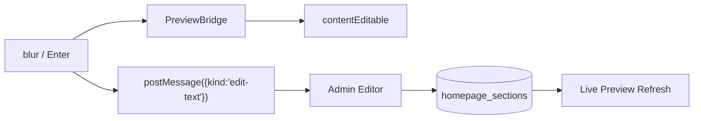
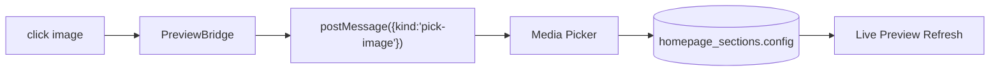
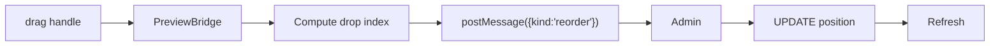

# No-Code Theme Builder Skill
**Version**: 1.0.0
**Purpose**: Complete no-code visual theme builder for HomeU e-commerce platform — let non-developers build, customize, and manage every section of their storefront without writing code.

## Architecture

The theme builder system is composed of:

1. **Settings Schema** (`apps/website/src/lib/theme-builder-settings.ts`)
   - Defines ALL configurable settings for every section type
   - Typed `SettingDefinition[]` per section
   - Supports: text, textarea, number, color, image_picker, select, range, checkbox, link, repeater, font_picker, alignment
   - Repeater items with nested sub-settings
   - Conditional visibility (`condition` field)
   - Grouping for admin UI organization

2. **Theme Types** (`apps/website/src/lib/theme-types.ts`)
   - `SectionType` union — ALL section types (including footer)
   - `SECTION_META` — labels, icons, descriptions
   - `HomepageSection` — DB shape (id, type, position, enabled, config)

3. **Theme Data Layer** (`apps/website/src/lib/theme.ts`)
   - `getHomepageSections()` — fetches body sections
   - `getFooterSections()` — fetches footer sections
   - `getHeaderSettings()` — header config from `site_settings`
   - `getThemePalette()` — palette from `site_settings`
   - `getCustomCss()` — custom CSS from `site_settings`

4. **Section Renderers** (`apps/website/src/components/home/HomeSections.tsx`)
   - Server component that maps section type → markup
   - Reads `config` from DB, uses `data-edit` and `data-edit-image` for live editing

5. **Preview Bridge** (`apps/website/src/components/home/PreviewBridge.tsx`)
   - Client component injected inside admin iframe (`?preview=N`)
   - Selection outlines, action toolbars, inline text editing, image picker
   - Drag-reorder sections, insert new sections, edit text inline
   - Communicates with admin via `postMessage`

6. **Admin Editor UI** (planned/implemented separately)
   - Reads `getSectionSettings(type)` to auto-render form controls
   - Reads `getGlobalSettings()` for theme palette editor

## How No-Code Editing Works

### Inline Text Editing (from Preview)

### Image Replacement

### Section Reordering (Drag)

## All Section Types with Settings

| Section Type | Configurable Settings | Settings Count |
|---|---|---|
| `slideshow` | Slides (image, heading, subheading, button, overlay), height, autoplay, arrows, dots | 14+ per slide |
| `brand_text` | Title, body, max-width, colors, spacing, animation | 13 |
| `collection_grid` | Heading, source, curated slugs, columns, aspect ratio, card radius, overlay, hover | 18 |
| `image_with_text` | Image, title, body, button, image position/size, colors, padding, spacing | 17 |
| `image_bar` | Image repeater, height, columns, gap, hover zoom | 10 |
| `featured_products` | Source, collection, curated IDs, columns, aspect ratio, price/badge, hover | 24 |
| `reviews` | Heading, columns, autoscroll, count, spacing | 12 |
| `instagram` | Handle, tile count, columns, gap, radius, link | 15 |
| `cta` | Heading, body, primary/secondary buttons, colors, spacing | 15 |
| `newsletter` | Heading, subtext, placeholder, button, colors, radius | 14 |
| `logo_bar` | Logos (repeater), width/height, gap, grayscale, hover | 12 |
| `testimonial` | Testimonials (repeater), columns, card style, colors | 13 |
| `stats_counter` | Stats (repeater), columns, colors, number size, animation | 12 |
| `blog_posts` | Heading, limit, layout (grid/list), columns, dates, image | 14 |
| `promo_bar` | Text, link, colors, font size, sticky, dismissible | 9 |
| `video_hero` | Video URL, poster, heading, subheading, overlay, height, muted | 17 |
| `lookbook` | Items (repeater with col/row span), columns, gap, radius | 10 |
| `category_carousel` | Heading, source, card width, image height, radius, gap | 13 |

### Footer Sections

| Section Type | Settings | Notes |
|---|---|---|
| `footer_brand` | Company name, tagline, address, email, phone | |
| `footer_quick_links` | Heading | Links come from navigation |
| `footer_newsletter` | Heading, description, placeholder, button | |
| `footer_social` | Heading, social URLs (7 platforms), icons toggle | |

## Common Settings (applied automatically to most sections)

- **Background**: bgColor, textColor
- **Spacing**: spacingTop, spacingBottom
- **Visibility**: hideMobile, hideDesktop
- **Animation**: entrance animation (fadeIn, slideUp, etc.) + delay
- **Advanced**: custom CSS class injection

## How to Add a New Section Type

1. Add the type string to `SectionType` in `theme-types.ts`
2. Add metadata to `SECTION_META` in `theme-types.ts`
3. Define settings array in `theme-builder-settings.ts`
4. Add the settings to `SECTION_SETTINGS_SCHEMA` map
5. Add the render case in `HomeSections.tsx`
6. Update `DEFAULT_SECTION_GAP` if needed

## Key Design Decisions

- **DB-driven**: Sections stored in `homepage_sections` table with JSON `config` column
- **Settings-first**: Admin UI auto-generates from `getSectionSettings()` — no manual form wiring
- **Default merge**: `mergeWithDefaults()` ensures every config has all keys
- **Validation**: `validateConfig()` checks types and ranges
- **Preview bridge**: No iframe? No preview. Only activates inside admin via `postMessage`
- **Resilient**: All server components use try/catch — empty DB = empty sections, not a crash

## Files Map

| File | Purpose |
|---|---|
| `apps/website/src/lib/theme-types.ts` | Type definitions, metadata |
| `apps/website/src/lib/theme.ts` | Data fetching (sections, header, palette, CSS) |
| `apps/website/src/lib/theme-builder-settings.ts` | **NEW** — Full settings schema for every section |
| `apps/website/src/components/home/HomeSections.tsx` | Server renderer for all sections |
| `apps/website/src/components/home/PreviewBridge.tsx` | Live preview interaction layer |
| `apps/website/src/components/SiteHeader.tsx` | Header with settings-driven layout |
| `apps/website/src/components/SiteFooter.tsx` | Footer rendering from DB sections |
| `apps/website/src/styles/globals.css` | CSS variables and base styles |
| `apps/website/src/styles/theme-tokens.css` | Debut theme token overrides |
| `apps/website/src/styles/debut-overrides.css` | Debut CSS class bridge |
| `apps/website/src/data/site-config.json` | Static site configuration |
| `apps/website/src/lib/homepage-collections.ts` | Curated collection slugs |

## Dependencies

- Next.js 14+ (App Router)
- PostgreSQL (via `src/lib/db.ts`)
- `postMessage` API for preview/admin communication
- No additional npm packages required

## Security

- All DB queries use parameterized inputs (no SQL injection)
- Preview bridge only activates when `window.parent !== window` (iframe check)
- Image uploads go through media picker (not direct URL input for security-sensitive contexts)
- Config JSON is validated server-side before DB write
