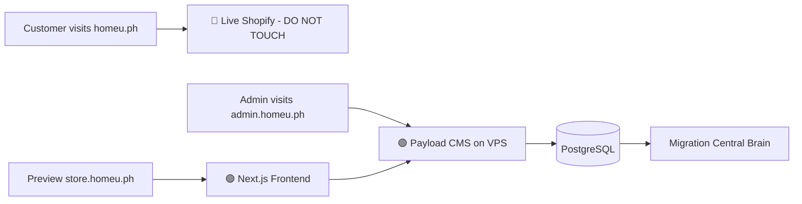
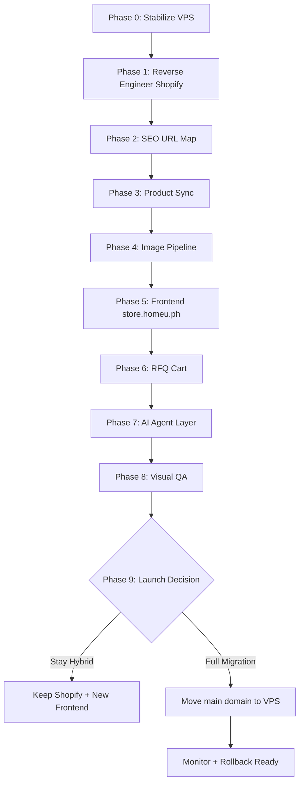
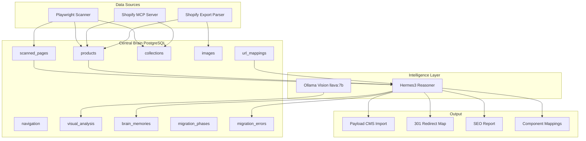
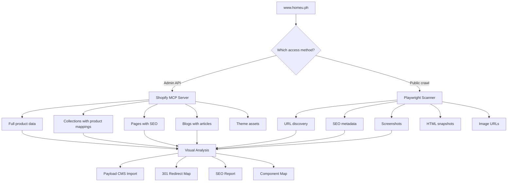
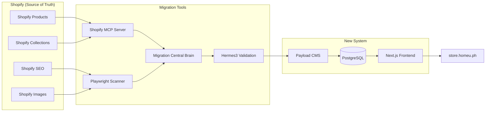
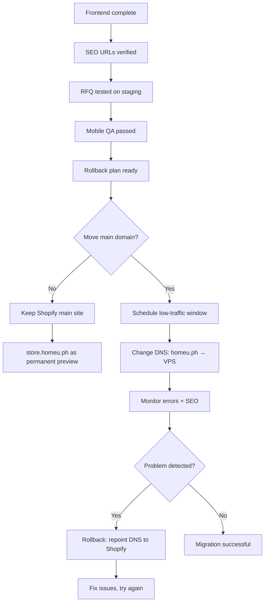
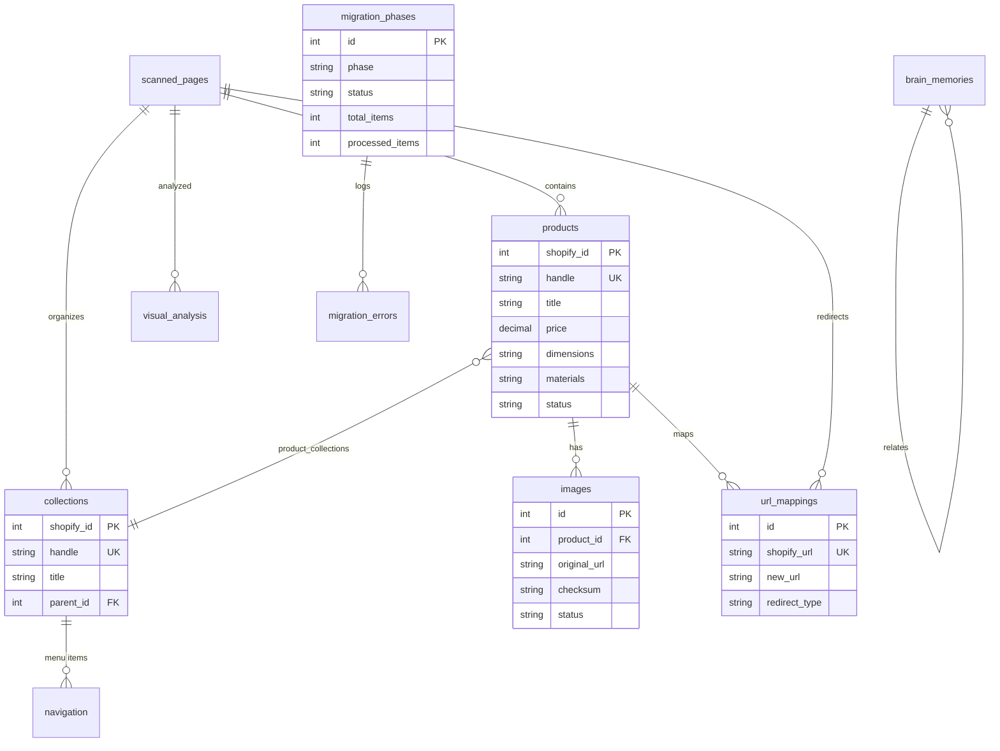

# Workflow Diagrams — HomeU Migration

## 1. Safe Domain Architecture



## 2. Migration Pipeline



## 3. Central Brain Architecture



## 4. Shopify Reverse Engineering Workflow



## 5. RFQ Cart Workflow

```mermaid
flowchart TD
    A[Customer views product] --> B{Has price?}
    B -- Yes --> C[Show price]
    B -- No --> D[Show "Contact for price"]
    C --> E[Add to RFQ button]
    D --> E
    E --> F[QuoteCart.tsx - localStorage]
    F --> G[Cart page - edit quantities/notes]
    G --> H[Submit RFQ form]
    H --> I[Payload CMS - RFQRequests collection]
    H --> J[Email notification to business]
    I --> K[Admin views in admin.homeu.ph/admin]
    K --> L[Update status: new/contacted/quoted/closed]
```

## 6. AI Agent Safety Workflow

```mermaid
flowchart TD
    A[User request] --> B[Hermes3 Reasoner]
    B --> C{Requires write?}
    C -- No --> D[Execute read-only]
    D --> E[Return results]
    C -- Yes --> F[Generate plan]
    F --> G[approval.mjs - ask user]
    G --> H{User typed "yes"?}
    H -- No --> I[❌ DENIED - no changes]
    H -- Yes --> J[✅ Execute with audit log]
    J --> K[Log to migration_errors/Central Brain]
```

## 7. Data Flow: Shopify → Payload → Frontend



## 8. Launch Decision Workflow



## 9. Migration Central Brain Data Model


