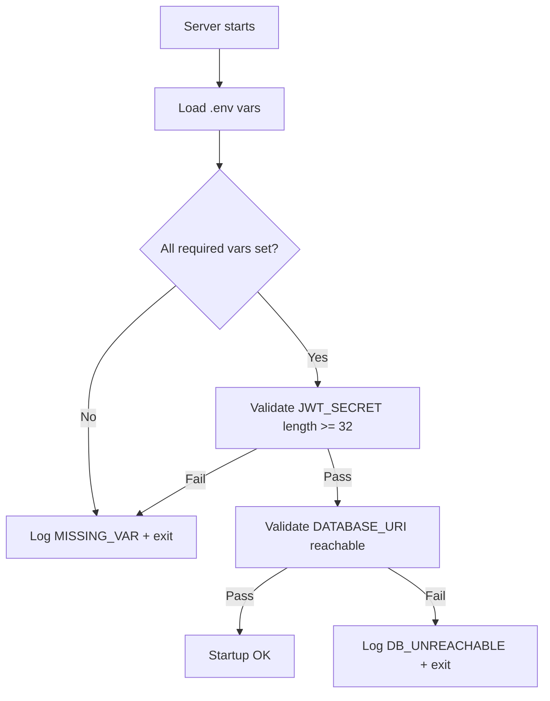
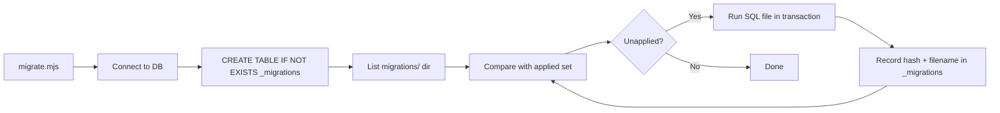
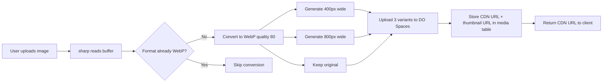
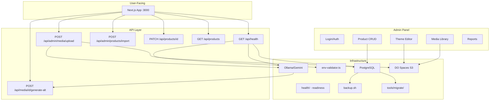

# Platform Improvements Plan

> **Status:** Design
> **Date:** 2026-06-19
> **Scope:** Stability infrastructure, Product schema upgrade, Media pipeline, Admin UI polish
> **Based on:** Duplicate audit against existing codebase

---

## Executive Summary

This plan covers 4 domains of improvement. ~60% of what was requested already exists or is in design docs;
this plan focuses on the genuinely missing pieces, in priority order.

| Domain | Already Built | New Work Needed |
|--------|--------------|----------------|
| **1. Stability** | Logger `central-logger.mjs`, Deployer health MCP, Backup design doc (400 lines) | Env validation, Healthcheck API, DB migrations, Backup implementation, Real GitHub Actions, Docker prod hardening |
| **2. Products** | Full CRUD admin, schema with title/slug/desc/price/seo/material/dimensions/images/status | short_description, tags, colors, related_products, CSV import, duplicate product, SEO preview, completeness score |
| **3. Media** | DO Spaces bucket wired, SHA-256 dedup, cdn-mirror/ scheme, sharp dependency | Structured paths, WebP pipeline, compression, alt text generation, missing image checker |
| **4. Admin UI** | ThemeEditor (1287 lines), AdminShell, Sidebar, Dashboard, Media, Products CRUD, MediaPicker | Minimal polish — completeness badge, missing-data filters UI |

---

## Phase 0: Foundation — Stability First

> **Rationale:** The user explicitly asked for stability before features. Do these first.

### 0.1 Env Validation

**File:** `apps/website/src/lib/env-validator.ts`



**Required vars to check:**
- `DATABASE_URI` — must be set and parseable
- `JWT_SECRET` — must be >= 32 chars
- `NEXT_PUBLIC_SITE_URL` — must be a valid URL
- `DO_SPACES_KEY` + `DO_SPACES_SECRET` — must be set (checked on first S3 op, not at boot)
- `AI_PROVIDER` + corresponding API key (if gemini/openai)

**Todo items:**
- [ ] Create `apps/website/src/lib/env-validator.ts` — checks required vars at import time, logs missing ones with `central-logger.mjs`, throws on fatal missing
- [ ] Call validator in `apps/website/src/lib/db.ts` (import-time side effect) and in `apps/website/src/app/layout.tsx` root layout

### 0.2 Healthcheck API Route

**File:** `apps/website/src/app/api/health/route.ts`

```json
GET /api/health
{
  "status": "ok" | "degraded" | "down",
  "timestamp": "2026-06-19T04:00:00.000Z",
  "checks": {
    "database": { "status": "ok", "latency_ms": 3 },
    "ollama": { "status": "ok", "latency_ms": 150 },
    "do_spaces": { "status": "ok", "latency_ms": 80 },
    "env": { "status": "ok" }
  }
}
```

**Todo items:**
- [ ] Create `apps/website/src/app/api/health/route.ts` — GET returns full status object; `db.ts` ping, `ollama-utils.ts` ping, DO Spaces head bucket, env validator pass/fail
- [ ] Create `apps/website/src/app/api/health/live/route.ts` — lightweight liveness (just returns `{ status: "ok" }` for k8s/Docker healthcheck)
- [ ] Create `apps/website/src/app/api/health/ready/route.ts` — readiness (DB ping + env check)

### 0.3 Database Migration System

**File:** `tools/migrate/migrate.mjs` + `tools/migrate/migrations/`

No migration system exists. The current approach is a raw SQL dump (`homeu-schema.sql`) that gets applied manually.

**Design — simple migration runner:**



**Migration folder convention:**
```
tools/migrate/migrations/
  001_create_extension_uuid.sql
  002_add_short_description_to_products.sql
  003_add_tags_table.sql
  ...
```

**Todo items:**
- [ ] Create `tools/migrate/migrate.mjs` — scans `migrations/` dir, tracks applied in `_migrations` table, runs unapplied in order, logs to central-logger
- [ ] Create `tools/migrate/migrations/001_initial_schema.sql` — the homeu-schema.sql content as migration 001
- [ ] Add `npm run migrate` script to root `package.json`
- [ ] Wire migration into Docker entrypoint (`docker/start.sh` or `Dockerfile CMD`)

### 0.4 Backup Implementation

**Existing:** [`plans/docker-backup-design.md`](plans/docker-backup-design.md) — 400-line design doc

**Implement the design:**
- [ ] Create `tools/backup/backup.sh` — `pg_dump` → gzip → timestamped filename → keep 7 daily + 4 weekly
- [ ] Create `tools/backup/backup-docker-compose.yml` — separate compose for backup container (runs on cron)
- [ ] Add `healthcheck:` block to each service in `docker-compose.yml` (postgres: `pg_isready`, website: `wget /api/health/live`)
- [ ] Wire backup script into Docker cron or systemd timer

### 0.5 Docker Production Hardening

**Improvements to existing [`docker-compose.yml`](docker-compose.yml) and [`Dockerfile`](Dockerfile):**
- [ ] Add `healthcheck` to `postgres` service: `pg_isready -U homeu`
- [ ] Add `healthcheck` to `website` service: `wget -qO- http://localhost:3000/api/health/live`
- [ ] Add `restart: unless-stopped` to all services (postgres already has it)
- [ ] Set `NODE_ENV=production` in Dockerfile (currently only in ENV, not ARG for Next.js)
- [ ] Add `.env.production` validation in the Docker entrypoint

### 0.6 Real GitHub Actions Workflow

**Current:** `.github/workflows/deploy.yml` is a **markdown document** — not a real YAML workflow.

- [ ] Create `.github/workflows/ci.yml` — lint + type-check + build only (runs on PR/push to main)
- [ ] Create `.github/workflows/deploy.yml` (overwrite the doc) — build + tag + deploy to VPS via SSH+rsync

**CI workflow:**
```yaml
name: CI
on: [push, pull_request]
jobs:
  quality:
    runs-on: ubuntu-latest
    steps:
      - uses: actions/checkout@v4
      - uses: actions/setup-node@v4
      - run: npm ci
      - run: npm run lint          # or next lint
      - run: npx tsc --noEmit       # type check
      - run: npm run build           # next build
```

### 0.7 Error Logging Expansion

**Existing:** `central-logger.mjs` exists and is wired in many places. Do a quick audit:
- [ ] Audit all bare `catch {}` blocks across `apps/website/src/` (reference GAP-LOW-005, GAP-LOW-010)
- [ ] Add `central-logger.mjs` logging to any still-silent catch blocks
- [ ] Add structured error fields: `{ error: err.message, code: err.code, component: 'chat-upload', action: 'handleUpload' }`

---

## Phase 1: Products — Schema Upgrade

### 1.1 New Database Fields

**Migration:** `tools/migrate/migrations/002_add_product_fields.sql`

```sql
ALTER TABLE products ADD COLUMN IF NOT EXISTS short_description TEXT;
ALTER TABLE products ADD COLUMN IF NOT EXISTS tags TEXT[] DEFAULT '{}';
ALTER TABLE products ADD COLUMN IF NOT EXISTS colors TEXT[] DEFAULT '{}';

CREATE TABLE IF NOT EXISTS related_products (
  id SERIAL PRIMARY KEY,
  product_id INTEGER NOT NULL REFERENCES products(id) ON DELETE CASCADE,
  related_product_id INTEGER NOT NULL REFERENCES products(id) ON DELETE CASCADE,
  created_at TIMESTAMPTZ DEFAULT NOW(),
  UNIQUE(product_id, related_product_id)
);

CREATE INDEX IF NOT EXISTS related_products_product_id_idx ON related_products(product_id);
```

### 1.2 Admin Form Fields

- [ ] Add `short_description` textarea to edit page
- [ ] Add `tags` multi-input (comma-separated or chip input)
- [ ] Add `colors` multi-input (color picker + hex chips)
- [ ] Add `related_products` searchable multi-select (fetch `/api/products?search=...`)
- [ ] Wire all new fields into `PATCH /api/products/[id]`

### 1.3 Bulk CSV Import

**Route:** `POST /api/admin/products/import`

**Format:**
```csv
title,slug,short_description,price,category,tags,materials,colors,image_url
Modern Sofa,modern-sofa,Comfortable 3-seater,45000,sofa,sofa;modern,linnen fabric;#beige;#cream,https://...
```

- [ ] Create `POST /api/admin/products/import` — accepts multipart CSV, parses with `csv-parse`, inserts rows in a transaction, returns `{ imported: N, errors: [...] }`
- [ ] Create import UI page: `apps/website/src/app/admin/products/import/page.tsx` — drag-drop CSV, shows preview, confirm import, results report
- [ ] Add `csv-parse` to `apps/website/package.json`

### 1.4 Bulk Image Attach

**Route:** `POST /api/admin/products/attach-images`

Accepts: `{ product_ids: number[], image_urls: string[] }` — attaches URLs to `product_images` table.

- [ ] Create `POST /api/admin/products/attach-images` — batch insert into `product_images` with sort_order, skip duplicates by URL
- [ ] Optional: accept zip with images → extract → upload to DO Spaces → attach

### 1.5 Duplicate Product

**Route:** `POST /api/admin/products/[id]/duplicate`

- [ ] Create `POST /api/admin/products/[id]/duplicate` — deep-copy product row, append " (Copy)" to title, generate new slug, copy `product_images` rows, return new product ID
- [ ] Add "Duplicate" button on product edit page

### 1.6 SEO Preview

**Component:** `apps/website/src/components/admin/SeoPreview.tsx`

Shows how the product will appear in Google search results:

```
┌──────────────────────────────────────┐
│ 🔗 store.homeatelier.ph/products/... │
│ 📝 Product Title | HOMEU.PH         │
│ Short description of the product...  │
│                                      │
│ SEO Title:     [________________]    │
│ SEO Desc:      [________________]    │
│ Preview:       [  Live Preview  ]    │
└──────────────────────────────────────┘
```

- [ ] Create `SeoPreview.tsx` — takes title, seoTitle, seoDescription, slug as props, renders Google-style SERP card
- [ ] Integrate into product edit page sidebar below SEO fields, updates live as user types

### 1.7 Product Completeness Score

**Utility:** `apps/website/src/lib/product-completeness.ts`

```typescript
interface CompletenessResult {
  score: number           // 0-100
  totalFields: number
  filledFields: number
  missingFields: string[]
}

function scoreProduct(product: Partial<ProductData>): CompletenessResult
```

**Scoring:**
| Field | Weight |
|-------|--------|
| title | 10 |
| price | 10 |
| description | 10 |
| short_description | 5 |
| images >= 1 | 15 |
| category | 10 |
| dimensions | 7 |
| materials | 7 |
| tags | 5 |
| colors | 5 |
| seo_title | 5 |
| seo_description | 5 |
| status !== draft | 6 |
| Total | 100 |

**Todo items:**
- [ ] Create `apps/website/src/lib/product-completeness.ts`
- [ ] Show completeness badge (color-coded) in product list table and edit page header
- [ ] Add `?missing=image,seo,price,category` filters to product list page (already exists as GAP-MED-007)

---

## Phase 2: Media Pipeline

### 2.1 Structured DO Spaces Paths

**Current scheme:** `cdn-mirror/<sha256>.<ext>` — flat, content-addressed.
**Target scheme:** `/products/{slug}/main.webp`, `/products/{slug}/gallery-01.webp`, etc.

**Strategy:** Adopt the new structure for **new uploads only**. Keep legacy `cdn-mirror/` paths for existing data. Both schemes coexist in the same bucket.

- [ ] Create `apps/website/src/lib/media-path.ts`:
  ```typescript
  function mediaPath(type: 'product' | 'collection' | 'blog', slug: string, variant: 'main' | 'gallery' | 'cover' | 'hero', index?: number): string
  // Returns: "products/modern-sofa/main.webp"
  ```

### 2.2 WebP Conversion Pipeline

**Hook into upload workflow:** When `POST /api/admin/media/upload` receives a PNG/JPG, use `sharp` to:
1. Convert to WebP
2. Generate 3 sizes: `original`, `800px`, `400px`
3. Upload all variants to DO Spaces
4. Store CDN URL in `media` table



- [ ] Create `apps/website/src/lib/image-pipeline.ts` — takes buffer, produces { original, medium, small } as WebP buffers with sharp
- [ ] Update `POST /api/admin/media/upload` to use pipeline + upload to DO Spaces
- [ ] Update `POST /api/chat/upload-image` similarly (or leave local for now — chat images are transient)

### 2.3 Image Compression

Already handled by WebP conversion (WebP is ~30% smaller than JPEG at same quality). Add:
- [ ] Set sharp quality defaults: jpeg: 80, png: 80, webp: 80
- [ ] Strip EXIF metadata during conversion (privacy + file size)

### 2.4 Alt Text Generation

**Route:** `POST /api/media/[id]/generate-alt`

Uses Ollama/Gemini vision to generate alt text from the image content, then patches the `media` record.

- [ ] Create `POST /api/media/[id]/generate-alt` — fetches image, sends to vision model with prompt "Describe this product image in 5-10 words for screen readers", updates `media.alt`
- [ ] Add "Generate Alt Text" button on media edit page
- [ ] Auto-generate alt text on upload (background task)

### 2.5 Missing Image Checker

**Script:** `tools/check-missing-images.mjs`

Scans all DB tables for products/categories/blog articles missing images:
```sql
SELECT id, title, slug FROM products WHERE id NOT IN (SELECT DISTINCT product_id FROM product_images)
```

- [ ] Create `tools/check-missing-images.mjs` — scans products, categories, articles; outputs report and optionally generates placeholder image URLs
- [ ] Add admin page "Reports > Missing Images" — `apps/website/src/app/admin/reports/missing-images/page.tsx`

### 2.6 CDN URL Replacement (Existing Tool, Verify)

[`tools/shopify-import/mirror-db-assets.mjs`](tools/shopify-import/mirror-db-assets.mjs) already does this for DB assets. Verify it was run successfully against prod:
- [ ] Run `node mirror-db-assets.mjs --verify` against the live database to check for remaining `cdn.shopify.com` references in `articles.image_url`, `products.description`, `homepage_sections.config`

---

## Phase 3: Admin UI Polish

Minimal work needed — the Theme Editor and admin panel are already robust.

- [ ] Add product completeness badge to `apps/website/src/app/admin/products/page.tsx` list table
- [ ] Add missing-data filter dropdown (reuses `?missing=` params) — already existing as GAP-MED-007
- [ ] Add "Media" tab to product edit page showing attached images with drag-to-reorder

---

## Implementation Order

```
Phase 0: Stability First
├── 0.1 Env Validation          → 1-2 files, low risk
├── 0.2 Healthcheck API         → 3 files, simple
├── 0.3 Migration System        → ~10 files (migrations dir), foundational
├── 0.4 Backup Implementation   → shell scripts, docker-compose
├── 0.5 Docker Prod Hardening   → edit 2 files
├── 0.6 GitHub Actions          → 2 yaml files
└── 0.7 Error Logging Expansion → audit + small fixes

Phase 1: Products Schema Upgrade
├── 1.1 New DB fields           → 1 migration SQL
├── 1.2 Admin form fields       → edit product edit page
├── 1.3 Bulk CSV import         → API route + UI page
├── 1.4 Bulk image attach       → API route
├── 1.5 Duplicate product       → API route + button
├── 1.6 SEO preview             → React component
└── 1.7 Completeness score      → lib + UI badge

Phase 2: Media Pipeline
├── 2.1 Structured paths        → lib utility
├── 2.2 WebP pipeline           → lib + upload route rewrite
├── 2.3 Image compression       → sharp defaults
├── 2.4 Alt text generation     → API route + vision
├── 2.5 Missing image checker   → tool + admin page
└── 2.6 CDN verify              → run existing tool

Phase 3: Admin UI Polish
├── Completeness badge on list
├── Missing-data filter dropdown
└── Media tab on product edit
```

---

## Architecture Diagram



---

## Files Changed Summary

| Phase | Files | Changes |
|-------|-------|---------|
| 0.1 | 1 new | `apps/website/src/lib/env-validator.ts` |
| 0.2 | 2 new | `apps/website/src/app/api/health/route.ts`, `.../live/route.ts`, `.../ready/route.ts` |
| 0.3 | 2+ new | `tools/migrate/migrate.mjs`, `tools/migrate/migrations/001_initial_schema.sql` |
| 0.4 | 2 new | `tools/backup/backup.sh`, `tools/backup/backup-docker-compose.yml` |
| 0.5 | 2 edit | `docker-compose.yml`, `Dockerfile` |
| 0.6 | 2 new | `.github/workflows/ci.yml`, `.github/workflows/deploy.yml` (overwrite doc) |
| 0.7 | ~5 edit | Various `apps/website/src/` files |
| 1.1 | 1 new | Migration SQL |
| 1.2 | 1 edit | `apps/website/src/app/admin/products/[id]/page.tsx` |
| 1.3 | 2 new | API route + import page |
| 1.4 | 1 new | API route |
| 1.5 | 2 edit | API route + product edit page button |
| 1.6 | 1 new | `SeoPreview.tsx` component |
| 1.7 | 1 new + 1 edit | `product-completeness.ts` + list/edit pages |
| 2.1 | 1 new | `apps/website/src/lib/media-path.ts` |
| 2.2 | 2 new + 1 edit | `image-pipeline.ts`, rewrite upload route |
| 2.3 | 0 | Already handled by sharp defaults |
| 2.4 | 1 new | API route + button |
| 2.5 | 1 new + 1 new | `check-missing-images.mjs` + admin page |
| 2.6 | 0 | Run existing `mirror-db-assets.mjs --verify` |
| 3.0 | ~3 edit | Various admin page edits |

---

## Referenced Existing Work

These items are **already built** and should NOT be re-created:

- **Logger:** [`tools/shared/central-logger.mjs`](tools/shared/central-logger.mjs)
- **Health tool:** [`tools/deployer-agent/deployer-mcp.mjs`](tools/deployer-agent/README.md#deployer-mcp) (MCP tool, not HTTP route — ours is new)
- **Backup design:** [`plans/docker-backup-design.md`](plans/docker-backup-design.md)
- **Product CRUD:** Admin products list + edit + create ([`apps/website/src/app/admin/products/`](apps/website/src/app/admin/products/page.tsx))
- **Media library:** Admin media list + edit + create + upload ([`apps/website/src/app/admin/media/`](apps/website/src/app/admin/media/page.tsx))
- **Theme editor:** 1287-line full ThemeEditor ([`apps/website/src/app/admin/theme/ThemeEditor.tsx`](apps/website/src/app/admin/theme/ThemeEditor.tsx))
- **Media picker:** [`apps/website/src/app/admin/theme/MediaPicker.tsx`](apps/website/src/app/admin/theme/MediaPicker.tsx)
- **DO Spaces creds:** In both `.env` and `apps/website/.env`
- **CDN migration tools:** [`tools/shopify-import/migrate-cdn-to-spaces.mjs`](tools/shopify-import/migrate-cdn-to-spaces.mjs), [`tools/shopify-import/mirror-db-assets.mjs`](tools/shopify-import/mirror-db-assets.mjs)
- **Existing GAP_LOG entries:** GAP-MED-035 (admin uploads not wired), GAP-MED-007 (missing data filters), GAP-LOW-005/LOW-010 (silent catch blocks)
