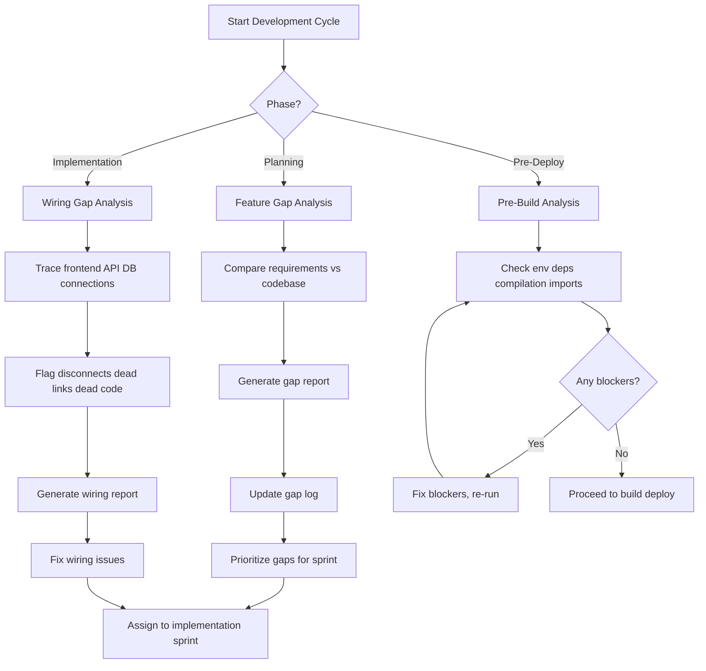

# SuperRoo Global Skills: Gap Analysis Trio

## Overview

Create three reusable SuperRoo global skills and one resource document that work together to provide systematic gap analysis for any project. These are designed as canonical SuperRoo assets under `C:/Users/user/.superroo/skills/` and `C:/Users/user/.superroo/resources/`, then wired into this project via pointer shims and a dedicated gap-analyst agent.

---

## Architecture

```
C:/Users/user/.superroo/
├── skills/
│   ├── feature-gap-analysis/SKILL.md     ← Compares declared features vs requirements
│   ├── wiring-gap-analysis/SKILL.md       ← Traces connections, flags disconnects
│   └── pre-build-analysis/SKILL.md        ← Gating checks before any build/deploy
└── resources/
    └── gap-analysis-framework.md          ← Combined workflow, taxonomy, report format

c:/Users/user/.homeu-commerce/
├── .roo/skills/                           ← Pointer shims (3 shims)
│   ├── feature-gap-analysis/SKILL.md
│   ├── wiring-gap-analysis/SKILL.md
│   └── pre-build-analysis/SKILL.md
├── agents/gap-analyst-agent.md           ← Project-level agent definition
└── tools/_gap_analysis.mjs               ← Existing gap analysis tool (will be referenced)
```

---

## Skill 1: Feature Gap Analysis

**Purpose:** Compare what exists in the codebase/database against what is required/expected, producing a structured gap report.

### Inputs
- Target specification (STATUS.md, admin roadmap, migration plan, product requirements)
- Ground truth sources (live data scans, database queries, API responses, file listings)
- Existing gap log (`docs/GAP_LOG.md` or equivalent)

### Analysis Dimensions
| Dimension | Checks |
|-----------|--------|
| Schema coverage | Do DB tables have all fields the requirements specify? |
| API coverage | Do all required API routes exist with correct HTTP methods? |
| UI/page coverage | Do all planned pages have route files? |
| Data completeness | Do records have required fields populated? |
| Feature parity | Do migrated features match original system features? |

### Output
- Structured JSON report with: `{ gap_id, dimension, severity, files[], description, impact, fix_guidance }`
- Update to gap log (append new gaps, update status of existing)

### Template
```
feature-gap-analysis/SKILL.md
├── When to use
├── Prerequisites
├── Analysis types and when to apply each
├── Step-by-step procedure
├── Report format
├── Integration with existing gap logs
├── Examples from this repo
└── Verification
```

---

## Skill 2: Wiring Gap Analysis

**Purpose:** Trace connections between layers (frontend → API → DB → schema) and flag disconnects, dead code, dead links, and broken imports.

### Trace Layers
```
Frontend Components
    ↓ (fetch/import calls)
API Routes
    ↓ (DB queries / external calls)
Database Tables / External Services
    ↓ (column references / endpoint contracts)
Schema / Type Definitions
```

### Analysis Dimensions
| Dimension | Checks |
|-----------|--------|
| Import resolution | Do all local imports resolve to actual files? |
| API wiring | Do frontend fetch URLs match actual API routes? |
| DB query wiring | Do SQL queries reference columns that exist? |
| Navigation wiring | Do links point to routes that exist? |
| Cross-module wiring | Do shared types/interfaces match between consumer and provider? |
| Event/notification wiring | Do event emitters have corresponding handlers? |

### Detection Rules
1. **Dead route** — file exists but no consumer links to it
2. **Dangling link** — `<Link href="/x">` but `/x` route doesn't exist
3. **Orphan API** — API route exists but no frontend calls it
4. **Missing API** — frontend calls `/api/x` but route file doesn't exist
5. **Stale query** — SQL references a column that doesn't exist in the schema
6. **Unused import** — import statement for a symbol that's never used in the file
7. **Bare catch** — catch block with no error handling/logging

### Output
- Same structured report format as Feature Gap Analysis
- Cross-reference with existing gap log entries

---

## Skill 3: Pre-Build Analysis

**Purpose:** A gating checklist executed before any `npm run build`, `next build`, `docker build`, or deploy operation. Unlike the project-level `preflight-sweep.mjs` (which is HomeU-specific), this is a generic reusable procedure.

### Pre-Build Gates

| Phase | Checks |
|-------|--------|
| 0. Environment | Node version, env files present, critical env vars set |
| 1. Dependencies | `package.json` integrity, `node_modules` exist, no stale packages |
| 2. Compilation | TypeScript compilation (`tsc --noEmit`), no `any` in critical paths |
| 3. Imports | All local imports resolve (recursive trace from entry points) |
| 4. Wiring | Quick wiring sanity (no dangling links, no missing API routes) |
| 5. Schema | DB schema migration status, critical tables exist |
| 6. Cleanliness | No dead files from previous frameworks, no placeholder secrets |
| 7. Git | Working tree clean (or intentional), committed changes |

### Multi-Mode
- `--quick` — phases 0-2 only (pre-commit)
- `--full` — all phases (pre-build/deploy)
- `--ci` — phases 0-6 with strict exit codes

### Exit Codes
| Code | Meaning |
|------|---------|
| 0 | All clean — proceed |
| 1 | Warnings — proceed with caution |
| 2 | BLOCKED — halt, fix all, re-run |

---

## Resource: Gap Analysis Framework

A reference document that ties the three skills together into a coherent methodology.

### Contents
- **Taxonomy** — gap types, severity levels, lifecycle states
- **Workflow** — when to run each analysis in the development lifecycle
- **Report Format** — markdown template for gap entries
- **Integration** — how skills connect to existing tools (`_gap_analysis.mjs`, `preflight-sweep.mjs`, `central-logger.mjs`)
- **Cross-Reference** — mapping of this SuperRoo skill set to existing SuperRoo skills (reliability-checklist, debug-evidence-loop, etc.)

---

## Project-Level Integration

### Gap Analyst Agent
A new agent registered in `.kilo/kilo.json` and `agents/gap-analyst-agent.md` that:
- Knows all three SuperRoo global skills
- Can invoke each analysis on demand
- Owns the gap lifecycle (discover → log → track → verify → close)
- Reports to the planner and orchestrator agents

### Pointer Shims
Three pointer shim files in `.roo/skills/` pointing back to canonical SuperRoo sources.

### Integration Points
- `tools/_gap_analysis.mjs` — existing HomeU-specific gap scanner; skills reference it as a project-specific implementation example
- `docs/GAP_LOG.md` — canonical gap log; skills reference it as the standard gap output location
- `tools/shared/preflight-sweep.mjs` — existing preflight sweep; Pre-Build skill references it as a project-specific implementation example

---

## Mermaid: Analysis Workflow



---

## Design Decisions

1. **Canonical location is SuperRoo, not project** — these are generic skills useful across any project, not just HomeU. The HomeU project gets pointer shims and a project-specific agent.

2. **Three separate skills, not one monolith** — each analysis has distinct inputs, outputs, and triggers. Keeping them separate improves retrieval precision when a SuperRoo agent needs only one.

3. **One shared resource document** — the framework resource ties them together without duplicating content across three skill files.

4. **Referential integration (not import)** — skills reference existing project tools (`_gap_analysis.mjs`, `preflight-sweep.mjs`) as examples of project-specific implementations, but don't wrap or depend on them.

5. **Skill format follows existing SuperRoo conventions** — standard markdown with frontmatter, tags, and structured sections matching the reliability-checklist, debug-evidence-loop, and other existing skills.

---

## Skills Detail Outline

### feature-gap-analysis/SKILL.md
```
---
name: feature-gap-analysis
description: Compare declared features vs actual implementation to find gaps
---

# Feature Gap Analysis

## When to Use
- Before starting a new phase of work
- When analyzing migration completeness
- When evaluating if requirements have been met

## Prerequisites
- Working codebase with known entry points
- Target specification (requirements doc, roadmap, migration plan)

## Procedure
1. Identify target specification
2. Enumerate declared/required features
3. Scan codebase for implementation evidence
4. Compare: exists, partial, missing
5. Classify by severity
6. Generate structured report
7. Update gap log

## Severity Classification
- 🔴 Critical: core flow broken, data loss risk
- 🟠 High: major feature missing, admin workflow blocked
- 🟡 Medium: missing feature, tech debt, poor UX
- 🔵 Low: polish, placeholders, documentation

## Report Format
See gap-analysis-framework resource.

## Examples
- `tools/_gap_analysis.mjs` — compares Shopify scan data vs backend schema
- `plans/remaining-gaps.md` — structured gap tracking
- `docs/GAP_LOG.md` — canonical gap log with full entries

## Verification
- All gaps have unique IDs
- Gaps are categorized by severity and type
- Fix guidance is actionable
```

### wiring-gap-analysis/SKILL.md
```
---
name: wiring-gap-analysis
description: Trace connections between layers and flag disconnects
---

# Wiring Gap Analysis

## When to Use
- After implementing new features
- Before refactoring or removing code
- When debugging integration issues

## Procedure
1. Discover all API routes (files under app/api/)
2. Trace frontend fetch/axios calls to API routes
3. For each API route, trace its DB queries
4. For each DB query, verify columns exist in schema
5. Check navigation links resolve to actual page routes
6. Check import statements resolve to actual files
7. Check event emitter/handler pairs

## Detection Reference
| Pattern | How to Detect |
|---------|--------------|
| Dead route | Route file exists, no fetch/import/ref points to it |
| Dangling link | `<a href=`, `<Link href=`, `router.push` to path that 404s |
| Missing API | Frontend fetch to path, no route file at that path |
| Stale query | SQL references column not in schema |
| Orphan import | Import of component that was deleted/renamed |

## Output
Structured report with each finding including:
- File and line number
- Layer (frontend, API, DB, schema)
- Connection type (fetch, import, link, query)
- Status (connected, missing, stale, orphaned)
```

### pre-build-analysis/SKILL.md
```
---
name: pre-build-analysis
description: Gating checklist before any build or deploy operation
---

# Pre-Build Analysis

## When to Use
- Before npm run build
- Before next build
- Before docker build
- Before any deploy operation

## Modes
- `--quick` (phases 0-2): Environment + Dependencies + Compilation
- `--full` (phases 0-6): All gates
- `--ci` (phases 0-6): All gates with strict exit codes

## Phase 0: Environment
- Node version meets minimum
- .env files exist for target environment
- Critical env vars are set
- Docker daemon running (if docker build)

## Phase 1: Dependencies
- package.json is valid JSON
- node_modules exists and packages resolve
- No stale orphan packages from removed frameworks

## Phase 2: Compilation
- tsc --noEmit succeeds (or closest available)
- No @ts-ignore unless justified

## Phase 3: Import Resolution
- All local imports from entry points resolve
- Recursive trace through all imports

## Phase 4: Wiring Sanity
- No 404 links from nav components (optional)
- API routes referenced by frontend exist (optional)

## Phase 5: Schema Alignment
- DB is reachable (if applicable)
- Migration status is current

## Phase 6: Cleanliness
- No placeholder secrets or hardcoded credentials
- No dead artifacts from previous framework versions

## Phase 7: Git State
- Working tree is committed (or intentional dirty state)
- Branch is correct for target environment

## Exit Codes
| Code | Meaning |
|------|---------|
| 0 | Pass — proceed |
| 1 | Warnings — proceed with caution |
| 2 | BLOCKED — halt, fix, re-run |
```

---

## Files to Create

| # | File | Type | Location |
|---|------|------|----------|
| 1 | `SKILL.md` | Canonical skill | `C:/Users/user/.superroo/skills/feature-gap-analysis/SKILL.md` |
| 2 | `SKILL.md` | Canonical skill | `C:/Users/user/.superroo/skills/wiring-gap-analysis/SKILL.md` |
| 3 | `SKILL.md` | Canonical skill | `C:/Users/user/.superroo/skills/pre-build-analysis/SKILL.md` |
| 4 | `gap-analysis-framework.md` | Canonical resource | `C:/Users/user/.superroo/resources/gap-analysis-framework.md` |
| 5 | `SKILL.md` | Pointer shim | `c:/Users/user/.homeu-commerce/.roo/skills/feature-gap-analysis/SKILL.md` |
| 6 | `SKILL.md` | Pointer shim | `c:/Users/user/.homeu-commerce/.roo/skills/wiring-gap-analysis/SKILL.md` |
| 7 | `SKILL.md` | Pointer shim | `c:/Users/user/.homeu-commerce/.roo/skills/pre-build-analysis/SKILL.md` |
| 8 | `gap-analyst-agent.md` | Project agent | `c:/Users/user/.homeu-commerce/agents/gap-analyst-agent.md` |

---

## User Approval Request

I've designed three SuperRoo global skills and supporting assets for systematic gap analysis. Here's what I'm proposing:

### The Three Skills

1. **Feature Gap Analysis** — Compares declared features vs actual implementation (schema coverage, API coverage, page coverage, data completeness, feature parity). Detects what's missing vs what's planned.

2. **Wiring Gap Analysis** — Traces connections between layers (frontend → API → DB → schema) and flags disconnects like dead routes, dangling links, missing APIs, stale queries, and orphaned imports.

3. **Pre-Build Analysis** — A reusable gating checklist with 8 phases (env, deps, compilation, imports, wiring, schema, cleanliness, git) that runs before any build or deploy. Multiple modes: --quick, --full, --ci.

### Architecture
- **Canonical** skills live in `C:/Users/user/.superroo/skills/` (shared across all extensions)
- **Pointer shims** in `.roo/skills/` for discovery within the HomeU project
- A **resource document** (`gap-analysis-framework.md`) ties the three together with taxonomy, workflow, and report format
- A project **agent definition** (`agents/gap-analyst-agent.md`) knows all three skills and owns the gap lifecycle

Do you approve this plan? Would you like adjustments to the scope, depth, or structure of any of the three skills?
